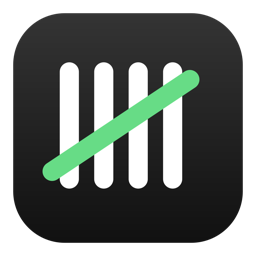
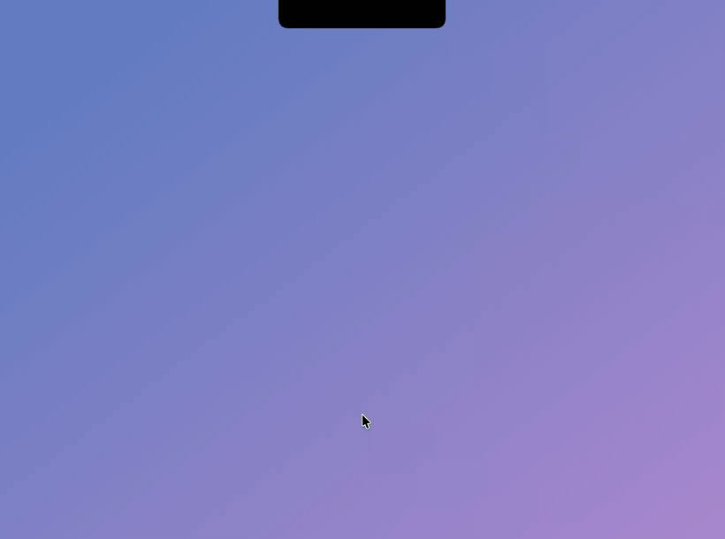
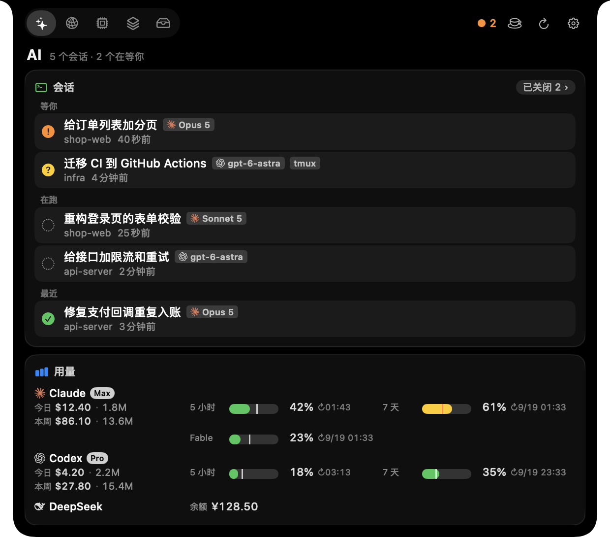
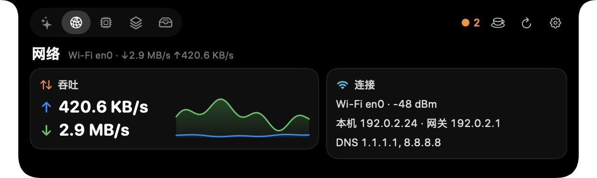
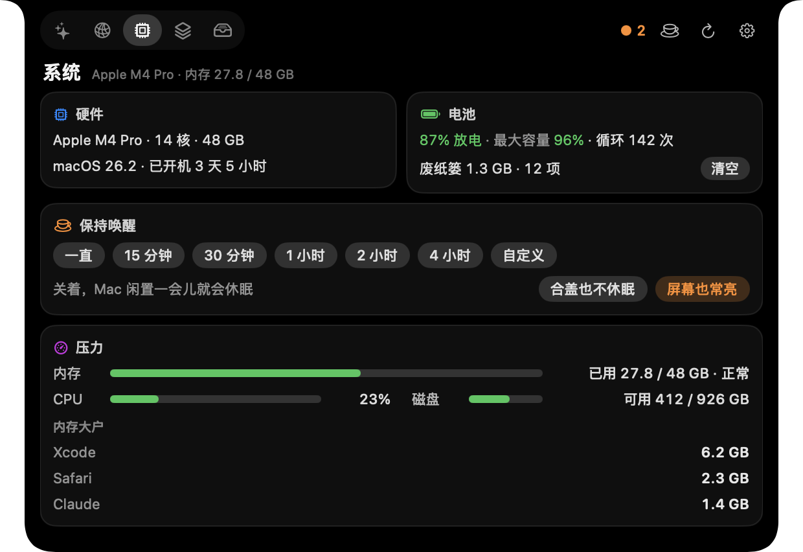
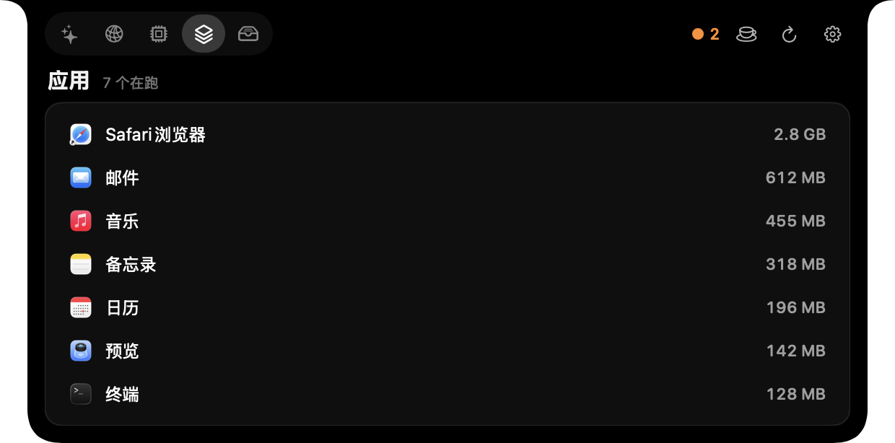
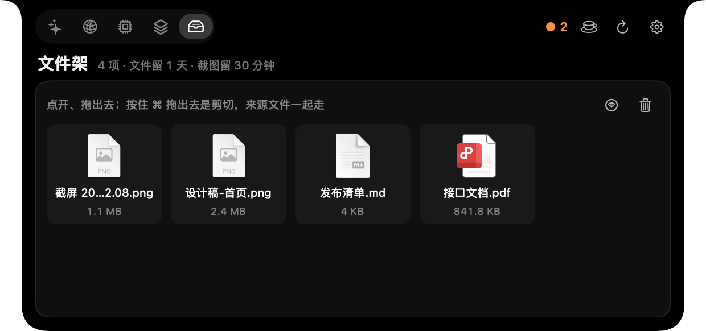

<div align="center">



# Tally

**Claude Code / Codex session status and AI quotas, living in your MacBook notch**<br>
Who is waiting on you, what just finished, how much quota is left — hover and you know.

[简体中文](README.md) | English

<a href="https://github.com/guokuaile/tally/releases/latest/download/Tally.dmg"></a>

Or with Homebrew (no quarantine step): `brew install --cask guokuaile/tally/tally`

  



</div>

> [!NOTE]
> The interface is currently **Simplified Chinese only**.

With several Claude Code / Codex sessions open you keep switching windows to see which one needs approval and which one is done, and you rarely notice a quota running out. Tally is a native macOS notch app (Dynamic Island-style) that tucks all of that into the notch: hooks report each session's state, quotas and usage come from each provider's API and local logs; it blends in with the notch until something happens, drops a small toast when it does, and expands into a full panel when you hover.

## Why Tally

- **See who needs you at a glance**: Claude Code and Codex sessions grouped into "waiting on you / working / recent"; when one needs approval, needs input or finishes, the notch drops a toast with a sound.
- **States you can trust**: Esc interrupts, API errors, and background subagents still running after the main turn ends are all handled — cases the hooks never report — so nothing stays stuck on "working".
- **Back to the terminal in one click**: click a row (or ⌘1–⌘9, ⌘0) to jump to that session's terminal tab, tmux panes included; closed sessions can be resumed in a new window.
- **Every provider side by side**: Claude, Codex, Cursor and Antigravity, plus DeepSeek, Kimi, Zhipu GLM and New API relays; Claude and Codex also show today / this week's spend and a pace line that tells you whether you'll run out before the reset, with alerts at 80% and when a quota is exhausted.
- **Local, native, dependency-free**: SwiftUI + AppKit; reads the tokens each tool already stored, read-only (never refreshes them, never writes to the Keychain); no telemetry.

Also on board: network throughput and proxy status, memory and battery, running apps, a file shelf, keep-awake (including with the lid closed), and an optional menu bar dinosaur.

## How Tally compares

| If you already use | What they focus on | What Tally adds |
|---|---|---|
| [CodexBar](https://github.com/steipete/CodexBar), [ccusage](https://github.com/ryoppippi/ccusage), [Claude Code Usage Monitor](https://github.com/Maciek-roboblog/Claude-Code-Usage-Monitor) | Claude / Codex usage and quotas in the menu bar or terminal | Session state on top of usage: who is waiting for approval, who just finished; click a row to jump to that terminal tab or tmux pane, resume a closed session in one click |
| [Claude Pulse](https://claudepulse.app/), [Vibe Island](https://vibeisland.app/), [AgentNotch](https://www.agentnotch.app/), [vibe-notch](https://github.com/farouqaldori/vibe-notch), [notchi](https://github.com/sk-ruban/notchi) | Claude Code sessions in the notch (some also cover Codex or Cursor) | States the hooks never report (Esc interrupts, API errors, subagents still running after the main turn) are still judged correctly; quotas for eight providers (Claude, Codex, Cursor, Antigravity, DeepSeek, Kimi, Zhipu GLM, New API) with spend and a pace line |
| [Atoll](https://github.com/Ebullioscopic/Atoll), [boring.notch](https://github.com/TheBoredTeam/boring.notch) | Music, file shelf and system info in the notch | Agent sessions and AI quotas first, with network, system, apps and a shelf on the side; zero dependencies, read-only tokens, no telemetry |

## Pages

<table>
  <tr>
    <td width="50%"><br><b>AI</b>: sessions + a usage row per provider</td>
    <td width="50%"><br><b>Network</b>: throughput, Wi-Fi, IP, DNS</td>
  </tr>
  <tr>
    <td width="50%"><br><b>System</b>: CPU, memory, battery, Trash</td>
    <td width="50%"><br><b>Apps</b>: running apps by memory</td>
  </tr>
</table>

- **AI**: rows show the provider logo and model. When a session finishes or needs you, the notch drops a toast with a sound — except while the panel is open, or when the session's Ghostty / Terminal.app / iTerm2 tab is already in front. With the lid closed and only external displays, alerts arrive as system notifications instead.
- **Network**: interface throughput (60-second sparkline), Wi-Fi signal, local IP, gateway, DNS; with a system proxy or proxy app running, an extra card identifies the app, its ports and whether TUN is present (plus the mode, when the mihomo core's control socket is available).
- **System**: chip, memory, CPU, disk, uptime, battery health, top memory users, Trash size with one-click empty.
- **Apps**: running apps by memory, with menu bar and background apps marked; click to open, right-click to quit.
- **Shelf**: drop files on the notch to keep a copy (`open -a Tally <file>` from scripts and new screenshots can land there too), then drag them out, AirDrop or open them; items are removed when their retention runs out (files 1 day, screenshots 30 minutes by default; adjustable in Settings).

<p align="center"></p>

**A 25-second walkthrough**: a toast drops, hover expands the panel, then AI, Network, System, Apps and Shelf.

https://github.com/user-attachments/assets/118fcdd1-92fb-4f42-9dde-9b452a773ada

Hover-to-expand, shortcuts, the shelf, sounds, quota alerts and each usage provider can be switched off individually in Settings; "hide the panel over full-screen apps" and "add new screenshots to the shelf" are off by default.

## Menu bar dinosaur

<p align="center">
  <picture>
    <source media="(prefers-color-scheme: dark)" srcset="docs/images/stride-dark.png">
    
  </picture>
  <br><sub>Sleeping · running · sprinting (egg orange past 70%) · angry (egg red and cracked past 85%)</sub>
</p>

Turn it on in Settings → 面板 (Panel); off by default. The dinosaur sleeps, runs and sprints with CPU load, and sprints or gets angry when memory runs tight; the egg in its nest fills up with memory use, turning orange at 70% and red and cracked at 85%. Click it to open the System page.

## Install

**Homebrew** (recommended, no quarantine step needed):

```bash
brew install --cask guokuaile/tally/tally
```

**Or download the DMG**:

1. Download [Tally.dmg](https://github.com/guokuaile/tally/releases/latest/download/Tally.dmg) and drag Tally into Applications.
2. Clear the quarantine flag once in Terminal, then launch it from Applications:

   ```bash
   xattr -dr com.apple.quarantine /Applications/Tally.app
   ```

> [!IMPORTANT]
> Tally is a personal project without an Apple Developer signature or notarization, so macOS blocks it by default — hence step 2. If you'd rather not use Terminal, open it once, then click "Open Anyway" at the bottom of System Settings → Privacy & Security. A message saying the app "is damaged and can't be opened" is the same issue; the command above fixes it.

Always launch it from Applications. When run straight from the DMG or Downloads, macOS moves the app to a temporary location and Settings refuses to register hooks (that path disappears after a restart).

**Requirements**: macOS 15 or later, Apple Silicon, a MacBook with a notch (14"/16" MacBook Pro from 2021, MacBook Air M2 and later); interface in Simplified Chinese. Tally launches on other Macs, but the panel never appears (alerts come as system notifications).

## Connect Claude Code and Codex

Open Settings (gear icon on the panel, or ⌘, while expanded) → "hook" → click "安装" (Install) for each side.

- The Claude side edits `~/.claude/settings.json`; the Codex side edits `~/.codex/hooks.json` and `~/.codex/config.toml` (trust hashes). Each file is backed up as `.tally-backup` first, and your other hooks are left alone. A custom `CLAUDE_CONFIG_DIR` / `CODEX_HOME` is respected, for hooks as well as usage and quotas.
- The Codex side needs the `codex` command to be available on this Mac.
- Sessions that were already open must be restarted; Codex reads hooks only at startup.
- Each side then shows when its hook last received an event. If it never does, "自检" (self-check) tells you whether the hook itself fails or the agent is not calling it.

## Support

| Agent | Session status | Jump to terminal | Resume |
|---|---|---|---|
| Claude Code | ✓ | ✓ | `claude --resume` |
| Codex | ✓ | ✓ | `codex resume` |

| Usage | Quota | Spend / balance |
|---|---|---|
| Claude | 5-hour, 7-day, per-model weekly (with pace line) | Today / week spend |
| Codex | 5-hour, 7-day (with pace line) | Today / week spend |
| Cursor | "Cursor models" and "other models" pools | — |
| Antigravity | Gemini and Claude pools | — |
| DeepSeek | — | Balance |
| Kimi | Kimi Code membership 5-hour, 7-day (with pace line) | Open platform balance |
| Zhipu GLM Coding Plan | 5-hour, 7-day (with pace line) | — |
| New API relay | — | Balance |

The last four are off by default; turn them on in Settings → 用量 (Usage). Keys are picked up from Claude Code settings, Kimi Code, zcode or opencode when present, otherwise enter them by hand. Zhipu's quota endpoint is undocumented and may break.

<details>
<summary><b>Which terminals a session row can jump to</b></summary>

| Terminal | Clicking a session |
|---|---|
| Ghostty, Terminal.app, iTerm2 | Selects the session's tab |
| tmux | Switches to the pane; selects the tab too when the outer terminal is Terminal.app / iTerm2, otherwise brings it forward |
| VS Code, Cursor | Opens the session's project window |
| Warp, kitty, WezTerm | Only activates the app (no stable scripting interface) |

Other terminals show a "window not found" message. Resume opens a new window in the session's original terminal (Ghostty, Terminal.app, iTerm2; a new tmux window under tmux); anything else uses Ghostty if installed, otherwise Terminal.app.

</details>

## Shortcuts

| Action | Result |
|---|---|
| Hover over / leave the notch | Expand / collapse |
| ⌥⇧T | Expand and pin / collapse |
| Two-finger swipe, three-finger swipe, keys 1–9 | Switch pages |
| ⌘1–⌘9, ⌘0 | Jump to session N (⌘0 is the 10th); hold ⌘ to see the numbers |
| Gear icon, ⌘, while expanded | Settings |
| Right-click the collapsed notch | Menu: Settings, refresh usage, quit |

## Permissions and privacy

**Asked for only when a feature needs it**

- **Automation (controlling terminals)**: jumping back, resuming, and checking whether a session's tab is in front. macOS asks once per terminal.
- **Administrator password**: only for "keep awake with the lid closed". Enabling it the first time installs `/etc/sudoers.d/tally`, a passwordless rule limited to the two `pmset` commands that toggle sleep and to removing the rule itself. Separately, if Tally finds lid-closed sleep disabled at launch and it wasn't Tally that disabled it, it offers a "恢复" (Restore) button that asks for the password once.
- **Keychain**: login credentials are read-only, fetched with the system `security` tool, normally without a prompt. Codex, Cursor and Antigravity normally read local files or a local service; the Keychain is only their fallback.
- **Notifications**: asked only when there is no notch display (lid closed with external displays) and the first alert needs to go out.
- **Folder access**: turning on "add new screenshots to the shelf" asks you to pick the screenshot folder once; the Desktop is privacy-protected and that pick is the grant, with no further prompt.

**Never requested**: screen recording, camera, microphone (the in-use dots only read device state), Accessibility, location, Full Disk Access.

**Data**: sessions, usage statistics and settings stay on your Mac. No telemetry, no auto-update. Outbound traffic is limited to two things: quota and balance lookups against each provider's official endpoints (Anthropic, OpenAI (ChatGPT), Cursor, Google (Antigravity), plus DeepSeek, Kimi / Moonshot, Zhipu / Z.ai and your New API site only when turned on; turn a provider off in Settings to stop contacting it; keys you enter stay in `~/Library/Application Support/Tally/providers.json`, readable only by you), and a daily check of GitHub for a new version (can be turned off in Settings → 通用; it only notifies and never downloads or replaces anything).

## Troubleshooting

- **The panel never appears**: it only shows on a built-in display with a notch, and hides when the lid is closed or only external displays are in use (alerts become system notifications). With "hide the panel over full-screen apps" on, it also stays away in full-screen apps.
- **Don't want the panel over full-screen video**: turn on "全屏 app 时隐藏面板" (hide over full-screen apps) in Settings → 面板 (Panel). Only system full screen counts (green button, ⌃⌘F).
- **"Damaged" or "unidentified developer"**: see step 2 of Install.
- **The session list is empty**: check Settings → hook for "installed" and a recent event; restart sessions that were open before installing; then try the self-check.
- **"要允许 Tally 控制 …" (allow Tally to control …) when clicking a session**: enable Tally's switch under System Settings → Privacy & Security → Automation. If it's missing, run `tccutil reset AppleEvents com.aiden.tally` and click again so macOS asks anew.
- **The terminal comes forward but the tab doesn't change**: Warp, kitty and WezTerm have no stable scripting interface, so activation is all Tally can do.
- **Quota says "登录已过期" (login expired)**: run a turn in Claude Code or Codex so it refreshes its own login. Tally never refreshes tokens.
- **A "~" after the percentage**: this refresh got no new reading, so the previous value is shown.

## Uninstall

1. In Settings → hook, click "移除" (Remove) for both sides; only Tally's own entries are deleted.
2. If you enabled launch at login, turn it off in Settings → 通用 (General); if you enabled keep-awake with the lid closed, remove its passwordless rule in Settings → 面板 (Panel).
3. Quit Tally and move `Tally.app` to the Trash.
4. For a clean slate, delete `~/Library/Application Support/Tally/`.

Installed with Homebrew: do step 1, then replace steps 3–4 with `brew uninstall --zap --cask tally` (also removes the data directory and the login item).

<details>
<summary><b>How it works</b></summary>

```
Claude Code / Codex ──hook──▶ tally-hook ──▶ ~/Library/Application Support/Tally/sessions/<id>.json ──▶ notch panel
                                                                                            ▲
                        transcripts and Claude Code's own session status (interrupts and errors)
```

The hook writes only two local things — the session state file and a "last event received" record for the self-check — then exits immediately; it never blocks the agent. The panel watches the sessions directory, and for what hooks can't report (interrupts, errors) it reads transcripts and Claude Code's own status. Quotas come from local logs and the providers' APIs. Design docs (in Chinese) live in [docs/](docs/README.md); contribution notes are in [CONTRIBUTING.md](CONTRIBUTING.md).

</details>

## Acknowledgements

- [Atoll](https://github.com/Ebullioscopic/Atoll): the usage data layer is ported from it (GPL-3.0); see [NOTICE](NOTICE) for the file list.
- [NotchDrop](https://github.com/Lakr233/NotchDrop): the shelf interaction is modeled on it; the code is a rewrite.
- [Lobe Icons](https://github.com/lobehub/lobe-icons): provider logos (MIT), as curated by [Pulse](https://github.com/qunqin24/Pulse).
- Borrowed ideas: [vibe-notch](https://github.com/farouqaldori/vibe-notch) and [CodeIsland](https://github.com/wxtsky/CodeIsland) (no alert while the session's tab is in front), [codenotch](https://github.com/vinzdg/codenotch) (reading Claude Code's own session status, 429 backoff), [codex-island](https://github.com/ericjypark/codex-island) (waiting a minute after wake before fetching quotas).

## License

[GPL-3.0](LICENSE). Claude, OpenAI, Codex, Cursor and Antigravity names and logos belong to their owners and are used only to label whose sessions and usage are shown. Tally is a personal project, not affiliated with Anthropic, OpenAI, Anysphere or Google.

---

<p align="center">If Tally saves you some window-switching, a ⭐ star helps other people running a pile of agents find it.</p>
